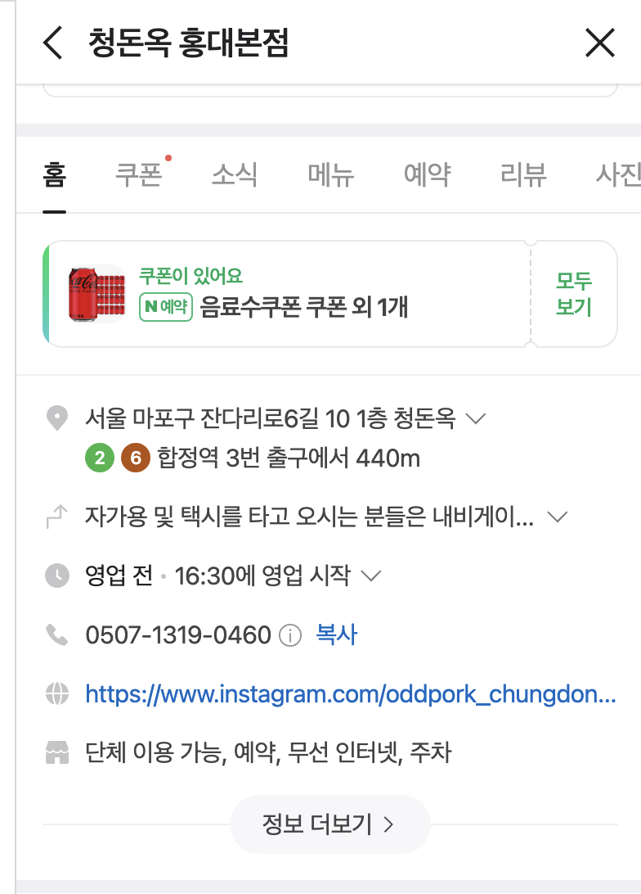
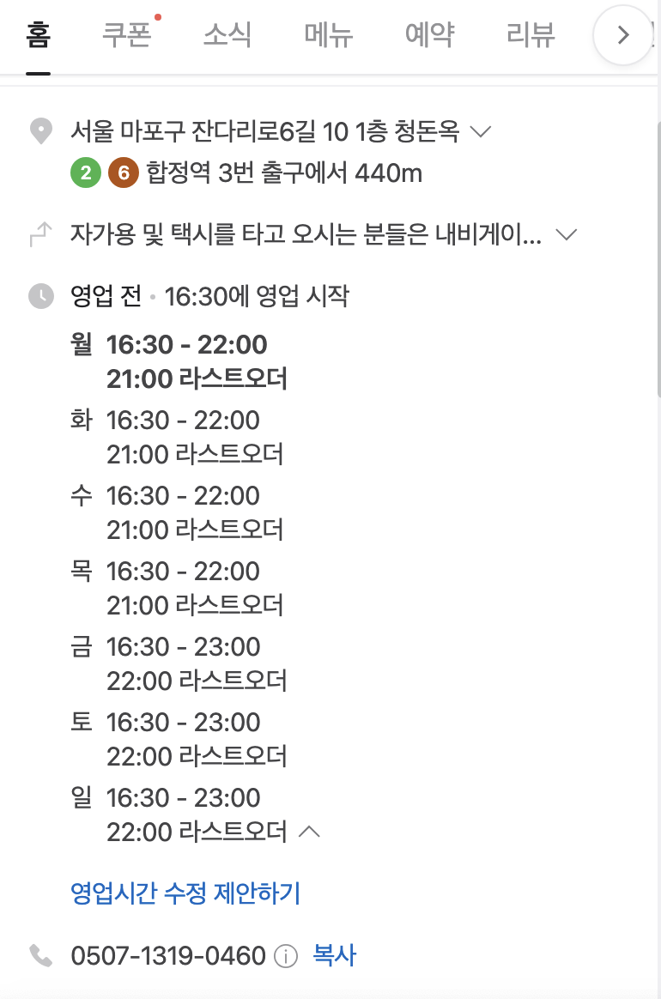
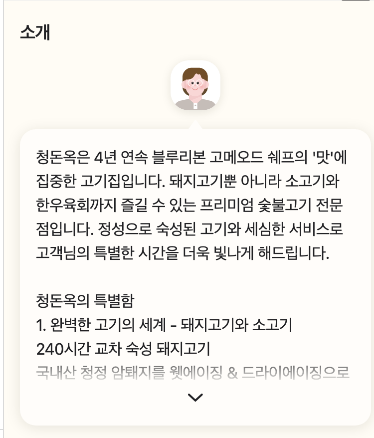
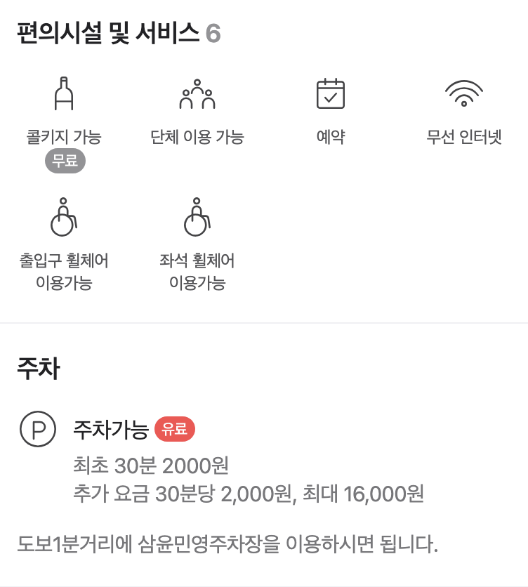

# 26th-project-JeMeChu
26기 신입기수 프로젝트 - 맞춤형 맛집 추천 서비스

## eda_restaurant.ipynb

아맞다. restaurant.csv는 용량이 너무 커서 올리지를 못하였다.
https://data.seoul.go.kr/dataList/OA-16094/S/1/datasetView.do
해당 주소에서 csv를 다운 받아서 이름만 restaurant.csv로 바꿔주면 실행이된다.
근데 정리가 된 restaurant_df.csv가 존재해서 해당 내용만 가지고 진행을 해도 된다.

일단 식당 파일을 읽어와서 기본적인 분석을 진행함

이때 식당에 대한 정보를 얻는데 필요한 col만 남겼다.
["상세영업상태명","전화번호", "소재지면적","소재지우편번호","지번주소","도로명주소", 
 "도로명우편번호", "사업장명","업태구분명", "좌표정보(X)", "좌표정보(Y)"]

지번주소에 서교동과 합정동을 포함하는 친구들만 필터링 해보았다.
추가로 현재 영업 중인 친구만 남도록 필터링하였다.

이렇게 해도 생각보다 필터링된 식당의 수가 많지 않았다.

추가로 업종 구분에 따라 추가 필터링을 진행하였다.
1. 카페와 같은 경우애는 분석을 하지 않기로 하였으므로 제외를 하였고
2. 출장조리는 식당의 개념이 아니어서 제외를 하였다.
3. 기타와 같은 경우에는 여러가지 업종의 식당들이 섞여 있어서 업종을 구분하는데 noise로 작용할 것이라고 생각하고 데이터의 integrity를 위해 제외하였다.

이후 처음 필터링한 데이터에서 필요없다 혹은 기재가 잘되지 않은 전화번호, 소재지 우편번호, 도로명 우편번호 등을 제거 하였다.

최종 csv를 얻어 냈으므로 해당 사업장명을 가지고 크롤링을 진행해보자!!

## analysis_restaurant.ipynb

위에서 필터링한 데이터를 활용해서 크롤링을 해보자.

이때 걱정되는 내용이 많다. 일단 네이버 지도 같은 경우에는 태그 이름을 주기적으로 수정하여 이슈가 발생한다. 
추가적으로 xpath로 지정하였음에도 잘 인식하지 못하는 부분은 class 명을 활용하였으므로 
추후에 잘 돌아가지 않는다면 해당 이슈가 있는 것으로 고려하면 될 것 같다.

셀레니움으로 크롤링을 진행하였다.
크롤링을 하면서 아쉬운 부분이 시간이 부족해서 식당과 관련된 정보를 모두 수집하지 못하였다.
해당 아쉬운 부분에 대해서는 사진으로 첨부해두겠다. 시간이 남으면 추가 크롤링하면 될 것으로 보인다.
네이버 제한에 걸리지 않기 위해서 random_sleep 활용을 많이하였다. 아마도. 1800, 2000 정도 되는 csv를 5등분해서
서로 나눠서 돌리면 훨씬 효율적이고 ip block issue를 피하기 좋을 것 같다.

셀레니움으로 크롤링을 진행하였을떄 아이디어는 아래와 같다.

사업장명으로 바로 네이버지도에 검색을 하면 다른 것을 찿는는 문제가 발생할 수 있다.
이를 해결하기 위해서
1. 도로명 주소로 검색을 진행한다.
2. 도로명 주소로 검색한 후 더보기를 누르고 이때 사업장명이 일치하는 것이 있는지를 찾아본다. 
이때 완벽 일치가 아닌 in으로 포함 관계로 확인한다. (솔직히 텍스트 매칭 할때는 어떤 식으로 체크하는지가 꽤나 중요하다고 생각한다)

이후 iframe으로 들어가준다 (걍 네이버 지도 로직이 이상하다. / 나도 잘 모름)

그리고 리뷰탭을 눌러준다.
이런 점이 좋았어요는 더보기 안누르고 4개까지 수집할 수 있어서 
이런점이 좋았어요 <- 리스트내 리스트꼴 : [[맛있어요, 100], [친절해요, 50]]
이런식으로 리스트내 리스트로 수집을 하였다.

이후 총리뷰개수를 가지고 온다. 이는 해당 식당의 인지도 혹은 인기, 관심도를 측정하는 척도가 될 것이라고 생각한다.

최신순으로 리뷰데이터를 수집한다. 그 이유는 식당의 맛은 계속 바뀐다. 그러면 최신 식당의 후기를 반영해야지 않겠냐?
내가 생각했을 때 이상적인것은 최근 6개월내 리뷰만 수집하는 것이라고 생각하였다.
하지만, 코드를 짜다보니 잘 모르겠어가지고 걍 최신 300개를 기준으로 수집하였다. 

최신 300개 리뷰 <- 리스트내 딕셔너리꼴 : 
[{'date' : 24.10.5 , 'text' : "맛나용 ㅋ"}, {'date' : 24.9.10, 'text' : "별로 ㅋㅋ"}]
이와 같이 리스트내 딕셔너리꼴로 데이터를 수집하였다. 

당연히 최근 리뷰를 수집할때 계속 더보기를 눌르는 형식이다. 내리고 더보기 누르고 그것의 반복...

이렇게 리뷰 수집 코드가 완료 되었다.
Py 파일이 아니다. 그냥 빨리 만들다보니까 직관적인 ipynb를 사용하였다.

** 하고싶은 말이 너무 많아서 더 적어본다. 
여기서 식당에 관한 정보를 충분히 수집할 수 있다.
이를 시도하였지만 초반에 몇번 실패하고 시간이 부족할까봐 일단 공란으로 남겨두었다.
그 대신 아이디어는 공유하겠다.
여기서 유의미하게 수집할 수 있는 정보는
1. 운영시간
2. 전화번호
3. 소개
4. 편의시설 및 서비스
5. 주차

수집할 수 있는 정보의 예시를 사진으로 만 제공하겠다.

