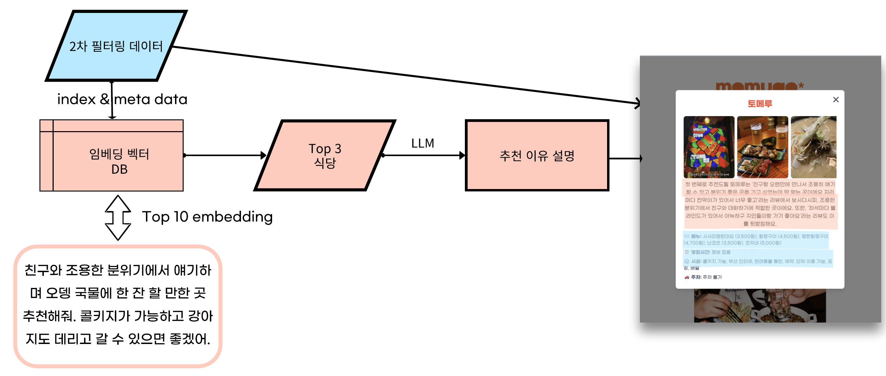

# 26th-project-JeMeChu
26기 신입기수 프로젝트 - 맞춤형 맛집 추천 서비스

---

## 요약




---

## Repository 구조
```
├── .gitignore                     # Git에서 제외할 파일 목록
├── README.md                     # 프로젝트 소개 문서

├── backend/                      # 백엔드 코드 및 관련 설정
│   ├── .dockerignore            # 도커 빌드시 제외할 항목
│   ├── Constants.py             # 프로젝트 공통 상수
│   ├── Dockerfile               # Docker 이미지 설정 파일
│   ├── requirements.txt         # 백엔드 파이썬 패키지 의존성
│   └── app/                     # 백엔드 실제 애플리케이션 코드
│       ├── database.py
│       ├── distance_utils.py
│       ├── main.py
│       ├── rag.py
│       ├── restaurant_filter.py
│       ├── test_db.ipynb
│       └── __init__.py

├── database/                    # 전처리된 데이터 및 CSV 파일 모음
│   ├── dropped.csv
│   ├── embedded_dropped_data.csv
│   ├── final_link_sql.csv
│   ├── final_sql.csv
│   ├── final_updated.csv
│   ├── frequency_test_adj_df.csv
│   ├── idwithreview.csv
│   ├── link_url.csv
│   ├── menu_updated.csv
│   ├── naver_data.csv
│   ├── photo.csv
│   ├── photo_url.csv
│   ├── preprocessed_naver.csv
│   ├── pre_embedding.csv
│   ├── pre_embedding_ready.csv
│   ├── price.csv
│   ├── restaurant_df.csv
│   ├── restaurant_final.csv
│   ├── restaurant_temp.csv
│   ├── reviews_naver.csv
│   ├── scraper_price_exception.csv
│   ├── SQL_DB.csv
│   ├── SQL_DB_check.csv
│   ├── SQL_DB_updated.csv
│   ├── test.csv
│   ├── test_updated.csv
│   └── updated_naver_map_data.csv

├── embedding/                   # 임베딩 처리 코드
│   ├── embedding.py
│   ├── embedding_onebyone.py
│   └── test/                    # 테스트용 임베딩 노트북/스크립트
│       ├── embedding_test.ipynb
│       ├── testfile_maker.ipynb
│       └── test_embedding.py

├── frontend/                    # 프론트엔드 React 기반 앱 (Next.js)
│   ├── .gitignore
│   ├── basic_image.png
│   ├── eslint.config.mjs
│   ├── logo.png
│   ├── next.config.ts
│   ├── package-lock.json
│   ├── package.json
│   ├── postcss.config.js
│   ├── README.md
│   ├── tailwind.config.js
│   ├── tsconfig.json
│   ├── app/                     # 페이지 및 스타일 구성
│   │   ├── favicon.ico
│   │   ├── globals.css
│   │   ├── layout.tsx
│   │   ├── page.tsx
│   │   ├── recommendations/
│   │   │   └── page.tsx
│   │   └── utils/
│   │       ├── highlightCore.tsx
│   │       ├── parseRestaurantData.ts
│   │       └── types.ts
│   ├── components/              # UI 컴포넌트
│   │   └── Sidebar.tsx
│   └── public/                  # 정적 자산
│       ├── file.svg
│       ├── globe.svg
│       ├── next.svg
│       ├── vercel.svg
│       ├── window.svg
│       ├── assets/
│       │   └── cursor.svg
│       └── fonts/
│           ├── GmarketSansTTFBold.ttf
│           ├── GmarketSansTTFLight.ttf
│           └── GmarketSansTTFMedium.ttf

├── images/                      # 이미지 파일들
│   ├── 1.png
│   ├── 2.png
│   ├── 3.png
│   ├── 4.png
│   └── 5.png

├── review_analysis/            # 리뷰 분석 관련 코드
│   ├── __init__.py
│   ├── crawling/               # 네이버 리뷰 크롤링 스크립트
│   │   ├── eda_restaurant.py
│   │   ├── scraper_naver.py
│   │   ├── scraper_photo_naver.py
│   │   ├── scraper_price.py
│   │   ├── scraper_price_exception.py
│   │   └── scraper_url_naver.py
│   ├── preprocessing/          # 리뷰 전처리 코드
│   │   ├── base_processor.py
│   │   ├── extra_preprocessing.ipynb
│   │   ├── main.py
│   │   ├── NaverProcessor.py
│   │   └── __init__.py
│   └── test/                   # 실험 및 분석 노트북
│       ├── analysis_restaurant.ipynb
│       ├── before_scraping.ipynb
│       ├── CheckforDetail.ipynb
│       ├── eda_restaurant.ipynb
│       ├── final_file_merging.ipynb
│       ├── frequency_test.ipynb
│       ├── frequency_test.png
│       ├── frequency_test_adj.png
│       ├── frequency_test_adj_nonoutlier.png
│       ├── frequency_test_df.csv
│       ├── MergeDetail.ipynb
│       ├── MergeDetail.R
│       ├── merge_url.ipynb
│       ├── quick_adjustment.ipynb
│       ├── scraper_price_exception.ipynb
│       ├── test.ipynb
│       ├── text_counter.ipynb
│       ├── unique_features.txt
│       └── visualize_frequency.R

├── server/                      # 파인콘 벡터 DB 연동 및 관련 스크립트
│   ├── DB_UPDATE.ipynb
│   ├── from pinecone import Pinecone.py
│   ├── id_mapping.ipynb
│   ├── pinecone_setup.py
│   ├── test_db_connect.py
│   ├── test_filtering.ipynb
│   ├── test_vector.py
│   ├── upload_sql.py
│   └── upload_vector.py

└── translate/                   # 번역 및 문장 분할 관련 노트북
    ├── converted_test.txt
    ├── divide_sentence.ipynb
    ├── preprocessed_naver.csv
    ├── test.txt
    └── translate_test.ipynb
```
